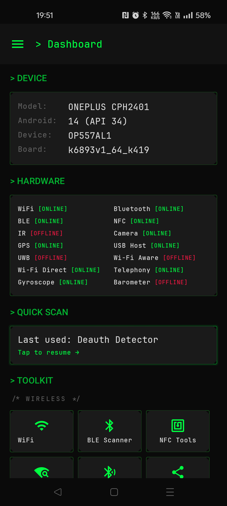
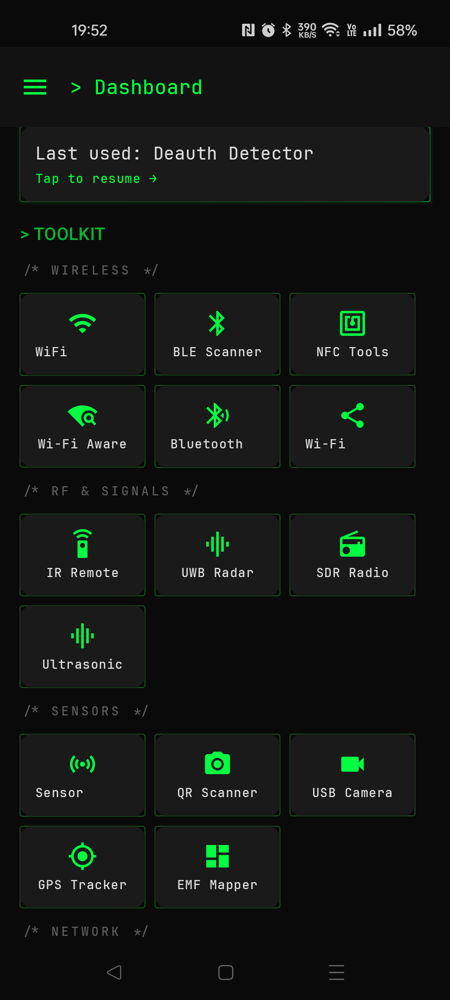
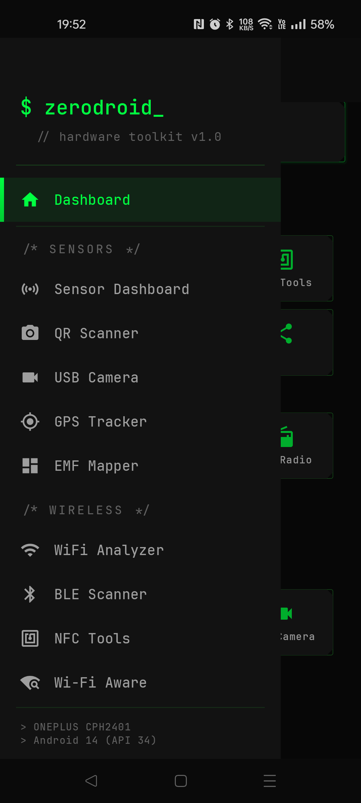

# ZeroDroid

**The all-in-one Android hardware toolkit.**

ZeroDroid turns your phone into a portable RF lab, network analyzer, and security auditor. It exposes every radio, sensor, and port your device has — WiFi, Bluetooth, BLE, NFC, IR, UWB, USB, GPS, cellular, magnetometer, barometer, microphone — through 27 specialized tools with a terminal-hacker aesthetic.

Built for penetration testers, security researchers, RF engineers, and anyone who wants to understand the wireless world around them.

---

## Table of Contents

- [The Problem](#the-problem)
- [What ZeroDroid Does About It](#what-zerodroid-does-about-it)
- [Screenshots](#screenshots)
- [Architecture](#architecture)
- [Setup & Build](#setup--build)
- [Dashboard](#dashboard)
- [All 27 Tools — Detailed Guide](#all-27-tools--detailed-guide)
  - [Wireless Tools](#wireless-tools)
  - [RF & Signal Tools](#rf--signal-tools)
  - [Sensor Tools](#sensor-tools)
  - [Network Tools](#network-tools)
  - [Security Tools](#security-tools)
- [Battery Optimization](#battery-optimization)
- [Permissions](#permissions)
- [Hardware Compatibility](#hardware-compatibility)
- [Tech Stack](#tech-stack)
- [Project Structure](#project-structure)
- [Ethical Use](#ethical-use)
- [License](#license)

---

## The Problem

Your phone has 10+ radios and sensors that are invisible to you. Right now, within 30 meters of where you're sitting:

- **Hidden cameras** may be broadcasting on WiFi or BLE — you have no way to detect them.
- **AirTags or SmartTags** could be tracking your location — you wouldn't know unless someone told you.
- **Rogue WiFi access points** (evil twins) mimic legitimate networks to steal your credentials — your phone will auto-connect to them.
- **IMSI catchers** (Stingrays) force your phone to 2G to intercept calls and texts — completely invisible.
- **Ultrasonic beacons** in the 18-24 kHz range track you across devices through your microphone — inaudible to human ears.
- **Deauthentication attacks** kick you off WiFi repeatedly — they look like "bad signal" to most people.
- **USB devices** you plug in might be BadUSB attacks pretending to be keyboards.
- **Your own device** may have developer options, mock locations, or missing encryption without you knowing.

There is no single app that detects all of these. Security professionals carry multiple devices and run multiple tools. Regular users have no tools at all.

## What ZeroDroid Does About It

ZeroDroid consolidates **27 tools** into one app. Every tool solves a specific, real problem:

| Problem | ZeroDroid Tool | How It Helps |
|---------|---------------|--------------|
| Can't see who's on your WiFi | WiFi Analyzer | Scans all networks, analyzes channel congestion, identifies security weaknesses |
| Unknown Bluetooth devices nearby | BLE Scanner | Discovers, identifies, and explores every BLE device with full GATT inspection |
| Might be tracked by an AirTag | Tracker Scanner | Identifies AirTags, SmartTags, Tiles, Chipolos, Pebblebees by BLE signatures |
| Hidden cameras in hotel/Airbnb | Camera Detector | 5 detection methods: WiFi OUI, SSID patterns, BLE, magnetometer, port scanning |
| Connected to a fake hotspot | Rogue AP Detector | 6 algorithms: Evil Twin, SSID spoofing, Karma attack, open impersonator detection |
| WiFi keeps disconnecting | Deauth Detector | Detects deauth floods, signal jamming, AP disappearance, channel hopping |
| GPS location being spoofed | GPS Spoof Detector | 7 cross-validation checks comparing GPS, cell towers, WiFi, barometer, accelerometer |
| IMSI catcher near you | Cell Tower Analyzer | Monitors cell towers for LAC changes, signal spikes, forced 2G downgrades |
| Suspicious USB device | USB Inspector | Identifies BadUSB attacks (HID + Mass Storage combo), inspects all endpoints |
| Bugs/transmitters in a room | RF Bug Sweeper | Combined BLE module detection, ultrasonic beacon scanning, magnetic anomaly mapping |
| Unknown NFC tags | NFC Tools | Reads NDEF, dumps MIFARE Classic sectors, emulates tags via HCE |
| No TV remote | IR Remote | Pre-built Samsung/LG/Sony remotes, custom protocol support, Flipper Zero file import |
| Need to map WiFi coverage | Wardriving | Background GPS+WiFi logging with WiGLE CSV export |
| Vulnerable devices on network | Network Scanner | Subnet-wide port scanning with banner grabbing and vulnerability assessment |
| Overall security posture unknown | Privacy Score | 16+ checks across WiFi, Bluetooth, device config, network, and physical security |
| Need to log signal changes | Signal Logger | Continuous WiFi+BLE signal timeline with arrival/departure tracking |
| Want a radar view of devices | Proximity Radar | Visual radar plotting devices by estimated distance and signal strength |
| Track ultrasonic surveillance | Ultrasonic Analyzer | FFT spectrum analysis of 18-24 kHz range to detect tracking beacons |
| Check device sensor accuracy | Sensor Dashboard | Real-time accelerometer, gyroscope, magnetometer, barometer, compass, tilt meter |
| Detect metal/electronics | EMF Mapper | Magnetometer-based field mapping with baseline deviation and hotspot detection |
| Scan QR codes safely | QR Scanner | Threat analysis for phishing URLs, suspicious TLDs, IP-only links before opening |
| SDR hardware detection | SDR Radio | Detects RTL-SDR, HackRF, AirSpy dongles via USB OTG |
| UWB capability check | UWB Radar | Shows FiRa compliance, distance measurement, AoA/ToF support |
| Classic Bluetooth devices | Bluetooth Classic | Discovery, SDP service listing, SPP serial connections |
| WiFi Aware networking | Wi-Fi Aware | NAN-based device-to-device discovery without a router |
| P2P file transfer | Wi-Fi Direct | Peer discovery, group formation, direct file transfer |
| External camera detection | USB Camera | UVC device detection with resolution and capability listing |

---

## Screenshots

<p align="center">
  
  &nbsp;&nbsp;
  
  &nbsp;&nbsp;
  
</p>

<p align="center">
  <em>Dashboard</em> &nbsp;&nbsp;&nbsp;&nbsp;&nbsp;&nbsp;&nbsp;&nbsp;&nbsp;&nbsp;&nbsp;&nbsp;&nbsp;&nbsp;&nbsp;&nbsp;&nbsp;&nbsp;&nbsp;&nbsp;&nbsp;&nbsp;
  <em>Toolkit</em> &nbsp;&nbsp;&nbsp;&nbsp;&nbsp;&nbsp;&nbsp;&nbsp;&nbsp;&nbsp;&nbsp;&nbsp;&nbsp;&nbsp;&nbsp;&nbsp;&nbsp;&nbsp;&nbsp;&nbsp;&nbsp;&nbsp;&nbsp;&nbsp;&nbsp;
  <em>Navigation</em>
</p>

---

## Architecture

```
ZeroDroidApp (Application)
 └── AppContainer (manual DI — all services lazy-initialized)
      ├── System Services (SensorManager, WifiManager, BluetoothManager, ...)
      ├── HardwareChecker (16 capability queries)
      ├── Room Database (4 entities: BLE, NFC, Wardriving, QR)
      ├── Phase 1: SensorDataCollector, WifiScanner, BleScanner
      ├── Phase 2: USB, CellTower, IR, NFC, SDR, Ultrasonic, GPS, ...
      ├── Phase 3: BluetoothClassic, SPP, MIFARE, SDP, WiFi Direct
      └── Phase 4: HiddenCameraDetector

Navigation: Jetpack Navigation Compose + ModalNavigationDrawer
Pattern: MVVM (Screen → ViewModel → Domain → Hardware)
UI: Jetpack Compose + Material 3 (dark terminal theme)
Font: JetBrains Mono throughout
```

**Key design decisions:**

- **All services are lazy-initialized.** Nothing starts until you navigate to that feature. The app launches to a zero-cost Dashboard.
- **No auto-start scanning.** Every scanner requires a manual tap to start, and auto-stops after a timeout (sensors: 60s, WiFi/BLE: 30s).
- **No `saveState` in navigation.** When you leave a screen, its `DisposableEffect.onDispose` fires and scanning stops immediately.
- **Sensor polling at 5Hz, not 60Hz.** `SENSOR_DELAY_NORMAL` instead of `SENSOR_DELAY_UI` — 12x fewer events with no visible difference.
- **BLE uses `SCAN_MODE_LOW_POWER`** instead of `LOW_LATENCY` — 10x less battery drain.

---

## Setup & Build

### Prerequisites

- Android Studio Ladybug (2025.1+) or newer
- JDK 17+
- Android SDK 36
- A physical Android device (many features require real hardware)

### Build

```bash
git clone <repo-url>
cd ZeroDroid
./gradlew assembleDebug
```

### Install

```bash
adb install -r app/build/outputs/apk/debug/app-debug.apk
```

### Requirements

| Requirement | Minimum |
|-------------|---------|
| Android version | 8.0 (API 26) |
| Target SDK | 36 |
| Recommended | Android 12+ for full BLE/WiFi features |

---

## Dashboard

The Dashboard is the home screen. It costs zero battery — it only reads static `Build.*` properties and `PackageManager` queries.

### > DEVICE
Shows your device model, Android version, device codename, and board.

### > HARDWARE
A compact 2-column grid showing which hardware your device has:

```
WiFi [ONLINE]        Bluetooth [ONLINE]
BLE [ONLINE]         NFC [ONLINE]
IR [OFFLINE]         Camera [ONLINE]
GPS [ONLINE]         USB Host [ONLINE]
UWB [OFFLINE]        Wi-Fi Aware [OFFLINE]
Wi-Fi Direct [ONLINE] Telephony [ONLINE]
Gyroscope [ONLINE]   Barometer [OFFLINE]
```

This tells you at a glance which tools will work on your device.

### > QUICK SCAN
Remembers the last tool you used (persisted to SharedPreferences). Tap to jump back instantly.

### > TOOLKIT
All 27 tools as tappable tiles, grouped by category: Wireless, RF & Signals, Sensors, Network, Security Tools.

---

## All 27 Tools — Detailed Guide

### Wireless Tools

---

#### 1. WiFi Analyzer

**What it solves:** You can't see which WiFi channels are congested, which networks have weak security, or what's broadcasting around you.

**How to use:**
1. Navigate to WiFi Analyzer
2. Tap **Scan** to start discovery
3. Filter by band: All / 2.4 GHz / 5 GHz
4. Review the channel chart to find the least congested channel for your router
5. Scan auto-stops after 30 seconds

**What you see per network:**
- SSID (network name) and BSSID (hardware address)
- Signal strength in dBm and as a percentage
- Frequency, channel number, and band
- Channel width (20/40/80/160 MHz)
- Security type: OPEN, WEP, WPA, WPA2, WPA3
- Channel congestion score

**Why it matters:** If your WiFi is slow, the problem is often channel congestion, not your internet speed. This tool shows you exactly which channel to switch to.

---

#### 2. BLE Scanner

**What it solves:** Dozens of invisible Bluetooth Low Energy devices surround you at all times — fitness trackers, beacons, smart home devices, headphones, potentially tracking devices. You can't see any of them without a scanner.

**How to use:**
1. Navigate to BLE Scanner
2. Tap **Scan** to start BLE discovery
3. Tap any device to see details
4. Tap a device row to open the **GATT Explorer** for deep inspection
5. Bookmark devices you want to track
6. Scan auto-stops after 30 seconds

**What you see per device:**
- Name and MAC address
- RSSI signal strength (dBm)
- Estimated distance in meters (log-distance path loss model)
- Device type classification: Audio, Fitness, Tracker, Input, TV/Media, Phone, SmartHome, etc.
- Service UUIDs being advertised

**GATT Explorer (sub-screen):**
- Connect to any BLE device
- Browse all services and characteristics
- Read/write characteristic values
- Enable notifications on characteristics
- Negotiate MTU size
- Full device dump to JSON

**Advanced features:**
- **HCI Snoop Log Parser:** Import and analyze Bluetooth HCI snoop binary files
- **BLE Device Dumper:** Connect, read ALL readable characteristics, export complete device profile as JSON

---

#### 3. NFC Tools

**What it solves:** NFC tags are everywhere — hotel key cards, transit cards, access badges, product tags — but you can't read or understand them without tools.

**How to use:**
1. Navigate to NFC Tools
2. Hold an NFC tag against the back of your phone
3. The app automatically reads the tag type and contents

**NDEF Reading:**
- URIs (with 36 protocol prefixes: http, https, tel, mailto, etc.)
- Plain text with language codes
- Smart Posters (URI + title + icon)
- WiFi credentials (auto-parsed)
- vCard contacts
- MIME type data

**MIFARE Classic:**
- Sector-by-sector authentication using Key A/B
- Tries 10 default keys automatically (FFFFFFFFFFFF, A0A1A2A3A4A5, D3F7D3F7D3F7, etc.)
- Block-level data dump in hex
- Access bits interpretation (read/write/increment/decrement permissions)
- Individual block writing

**Host Card Emulation (HCE):**
- Emulate a Type 4 NFC tag with custom NDEF data
- Your phone becomes the tag — other devices can read it
- Responds to standard SELECT AID and READ BINARY commands

**Tag history:** All scanned tags are saved to the database for later review.

---

#### 4. Bluetooth Classic

**What it solves:** Classic Bluetooth (not BLE) devices — speakers, headphones, car kits, OBD adapters — use a different protocol. BLE Scanner won't find them.

**How to use:**
1. Navigate to Bluetooth Classic
2. See paired devices and start discovery for new ones
3. Tap a device for SDP service discovery
4. Connect via SPP for serial communication

**What you see:**
- Device name, address, bond state
- Major device class (Computer, Phone, Audio/Video, Peripheral, etc.) with minor class details
- SDP service list with UUIDs and names
- SPP serial port connection management

---

#### 5. Wi-Fi Aware

**What it solves:** Sometimes you need to discover and communicate with nearby devices without any WiFi router or internet connection.

**How to use:**
1. Navigate to Wi-Fi Aware
2. Publish or subscribe to a service
3. Discover peers on the same service

**Requires:** Wi-Fi Aware hardware (Android 8.0+, limited device support).

---

#### 6. Wi-Fi Direct

**What it solves:** Transfer files between devices without WiFi or internet — useful in field conditions, air-gapped environments, or when infrastructure is down.

**How to use:**
1. Navigate to Wi-Fi Direct
2. Discover nearby peers
3. Connect and form a group
4. Transfer files directly

**What you see:**
- Discovered peers: name, MAC, device type
- Group info: network name, passphrase, group owner, client list
- File transfer progress

---

### RF & Signal Tools

---

#### 7. IR Remote

**What it solves:** Lost your TV remote, or need to control a device you don't have the remote for.

**How to use:**
1. Navigate to IR Remote
2. Select a pre-built remote (Samsung, LG, or Sony TV)
3. Point your phone's IR blaster at the TV
4. Tap any button — power, volume, channel, navigation, etc.

**Custom protocols:**
- Select protocol: NEC, Samsung32, RC5, RC6, Sony SIRC, or Raw
- Enter command data and carrier frequency
- Import Flipper Zero `.ir` files directly

**Requires:** Consumer IR blaster (available on some Samsung, Xiaomi, Huawei devices).

---

#### 8. UWB Radar

**What it solves:** Need to know if your device supports Ultra-Wideband for precise ranging and spatial awareness.

**What you see:**
- UWB availability status
- FiRa compliance
- Supported capabilities: distance measurement, Angle of Arrival, Time of Flight, IEEE 802.15.4z

---

#### 9. SDR Radio

**What it solves:** You have an SDR dongle (RTL-SDR, HackRF, AirSpy) connected via USB OTG and want to verify detection.

**What you see:** Device name, type, VID/PID. Recognizes 8 known SDR devices.

---

#### 10. Ultrasonic Analyzer

**What it solves:** Inaudible ultrasonic beacons (18-24 kHz) embedded in TV ads, store speakers, or apps can track you across devices through your microphone. You can't hear them, but your phone can.

**How to use:**
1. Navigate to Ultrasonic Analyzer
2. Grant microphone permission
3. The analyzer records at 48 kHz and runs a 4096-point FFT
4. Watch the frequency spectrum for energy spikes in the 18-24 kHz range

**What you see:**
- Full frequency spectrum visualization
- Highlighted ultrasonic range (18-24 kHz)
- Beacon detection alerts when energy peaks are found
- Tone generator to test your own ultrasonic output

---

### Sensor Tools

---

#### 11. Sensor Dashboard

**What it solves:** Need to verify your device's sensors are working correctly, check environmental conditions, or use your phone as a measurement tool.

**How to use:**
1. Navigate to Sensor Dashboard
2. Tap **Monitor** to start reading sensors
3. Auto-stops after 60 seconds to save battery
4. Tap again to restart

**Motion section:**
- **Accelerometer:** X/Y/Z acceleration in m/s^2
- **Level Meter:** Visual pitch/roll indicator — use your phone as a spirit level
- **Vibration Detector:** Real-time vibration magnitude with peak tracking and severity classification (None/Low/Moderate/High/Extreme), history graph
- **Gyroscope:** X/Y/Z angular velocity in rad/s

**Magnetic section:**
- **Magnetometer:** X/Y/Z magnetic field in microtesla
- **Compass:** Heading in degrees with visual compass
- **Metal Detector:** Tracks deviation from magnetic baseline — move your phone near metal objects to detect them, with audio alarm

**Environment section:**
- **Barometer:** Atmospheric pressure (hPa), estimated altitude (meters), estimated floor number
- **Light Sensor:** Illuminance in lux
- **Proximity Sensor:** Distance in centimeters

---

#### 12. QR Scanner

**What it solves:** QR codes can contain malicious URLs, phishing links, or suspicious content. Scanning blindly is risky.

**How to use:**
1. Navigate to QR Scanner
2. Point camera at any barcode or QR code
3. The app scans and **analyzes the content before you open it**

**Threat analysis checks:**
- Suspicious TLDs: `.tk`, `.ml`, `.ga`, `.cf`
- Phishing patterns: `login-verify`, `secure-update`, `account-confirm`
- IP-only URLs (no domain name)
- Excessively long URLs (>100 characters)
- Threat levels: SAFE, SUSPICIOUS, DANGEROUS

**Content parsing:** URLs, WiFi credentials, vCards, email, phone, SMS, geo coordinates, plain text.

**QR Generator:** Create QR codes for text, URLs, or WiFi credentials.

**Scan history:** All scans saved to database.

---

#### 13. USB Camera

**What it solves:** Need to detect external UVC cameras connected via USB OTG.

**What you see:** Device name, VID/PID, supported resolutions, USB class information.

---

#### 14. GPS Tracker

**What it solves:** Need precise GPS data, satellite information, or raw NMEA sentences for navigation, surveying, or debugging.

**How to use:**
1. Navigate to GPS Tracker
2. Grant location permission
3. See real-time position updates at 1-second intervals

**What you see:**
- Latitude, longitude, altitude, speed, bearing, accuracy
- **Satellite list:** For each visible satellite — SVID, constellation (GPS/GLONASS/Galileo/BeiDou/QZSS/SBAS/IRNSS), signal strength (C/N0), elevation, azimuth, whether used in current fix
- **NMEA log:** Last 50 raw NMEA sentences with timestamps

---

#### 15. EMF Mapper

**What it solves:** Need to map electromagnetic field strength in a room — useful for finding hidden electronics, checking EMF exposure, or locating wiring.

**How to use:**
1. Navigate to EMF Mapper
2. Walk around slowly with your phone
3. Watch for magnetic field deviations from baseline

**What you see:**
- Current magnetic field magnitude in microtesla vs. baseline
- Deviation color coding: NORMAL (<15 uT), ELEVATED (15-40), HIGH (40-100), EXTREME (>100)
- Hotspot detection for elevated readings
- Statistics: min, max, average magnitude

---

### Network Tools

---

#### 16. USB Devices

**What it solves:** A USB device plugged into your phone via OTG could be a BadUSB attack — a device that pretends to be a keyboard and types malicious commands.

**How to use:**
1. Plug in any USB device via OTG adapter
2. Navigate to USB Devices
3. See full device inspection

**What you see:**
- VID, PID, manufacturer, product name, serial number
- USB class, subclass, interface list, endpoints
- **BadUSB detection:** Flags devices presenting as both HID (keyboard/mouse) AND Mass Storage simultaneously, or HID devices without proper identity

**Live monitoring:** Real-time USB attach/detach events.

---

#### 17. Cell Tower Analyzer

**What it solves:** IMSI catchers (Stingray devices) intercept your calls and texts by impersonating cell towers. They're invisible to normal users.

**How to use:**
1. Navigate to Cell Tower
2. Grant phone state and location permissions
3. Monitor current and neighboring cell towers

**What you see per tower:**
- Technology: LTE, GSM, WCDMA, CDMA, NR (5G), TDSCDMA
- MCC (Mobile Country Code), MNC (Mobile Network Code)
- LAC/TAC (Location/Tracking Area Code), Cell ID
- Frequency channel (ARFCN/EARFCN)
- Signal strength (RSSI/RSRP)

**IMSI catcher detection (3 algorithms):**
1. **LAC change:** Sudden Location Area Code change without user movement
2. **Signal spike:** Signal jumps >20 dBm — indicates an amplified fake tower
3. **Forced 2G downgrade:** Network forcing LTE/3G down to GSM (where encryption is breakable)

---

#### 18. Wardriving

**What it solves:** Need to map WiFi coverage over a geographic area — for site surveys, security auditing, or contributing to wireless databases.

**How to use:**
1. Navigate to Wardriving
2. Start the scan — runs as a foreground service so it continues in the background
3. Drive, walk, or bike around
4. Export collected data as WiGLE CSV

**What you see:**
- Network list with SSID, BSSID, signal, security, GPS coordinates, timestamp
- Real-time network count

**Export:** Standard WiGLE CSV format compatible with [wigle.net](https://wigle.net) for community wireless mapping.

---

### Security Tools

---

#### 19. Hidden Camera Detector

**What it solves:** Hidden cameras in hotels, Airbnbs, changing rooms, or offices. Multiple detection methods because no single method catches everything.

**How to use:**
1. Navigate to Camera Detector
2. Grant all requested permissions (WiFi, BLE, Camera, Location)
3. Start the scan
4. Walk around the room slowly

**5 detection methods:**

| Method | How It Works | What It Catches |
|--------|-------------|-----------------|
| WiFi OUI | Checks MAC address prefixes against 30+ camera manufacturers (Hikvision, Dahua, Wyze, Ring, Nest, Arlo, etc.) | WiFi-connected cameras |
| WiFi SSID | Pattern matches network names for camera keywords | Cameras with default SSIDs |
| BLE Scan | Identifies camera-related BLE advertisements by name and OUI | Bluetooth-enabled cameras |
| Magnetometer | Detects magnetic anomalies >15 uT from baseline | Electronic devices hidden in walls/objects |
| Port Scan | Probes for RTSP (554, 8554), ONVIF (3702), HTTP (80, 8080) | Network cameras streaming video |

---

#### 20. GPS Spoof Detector

**What it solves:** GPS spoofing can make your phone report a false location — used to bypass geofencing, fake delivery locations, or mislead navigation.

**7 independent validation checks:**

| Check | What It Compares | Spoof Indicator |
|-------|-----------------|-----------------|
| GPS vs Cell Tower | GPS position vs cell tower location | Large distance discrepancy |
| Speed/Teleportation | Movement speed between fixes | Physically impossible speed |
| Altitude consistency | GPS altitude vs barometric altitude | Mismatch between sensors |
| Satellite count | Number of visible satellites | Count outside realistic range (4-32) |
| WiFi BSSID | Nearby WiFi networks | Sudden WiFi change without GPS movement |
| Accelerometer | Physical movement vs GPS movement | GPS says moving, accelerometer says still |
| Mock provider | Android mock location API | Mock location provider is enabled |

Overall confidence score aggregated from all checks.

---

#### 21. Tracker Scanner

**What it solves:** Someone may have placed a Bluetooth tracker (AirTag, SmartTag, Tile) in your bag, car, or belongings to follow your movements.

**How to use:**
1. Navigate to Tracker Scanner
2. Start BLE scanning
3. The app identifies known tracker signatures

**Detected trackers:**
- Apple AirTag
- Samsung SmartTag
- Tile (all models)
- Chipolo
- Pebblebee

**Detection method:** BLE name patterns, service UUIDs, and manufacturer-specific data bytes.

**Risk levels:**
- **HIGH:** Device seen >5 times AND tracked for >10 minutes
- **MEDIUM:** Device seen >3 times
- **LOW:** Recently detected, not yet persistent

---

#### 22. Rogue AP Detector

**What it solves:** Fake WiFi access points that steal your credentials — the most common WiFi attack.

**6 detection algorithms:**

| Attack Type | How Detected | Risk Level |
|-------------|-------------|------------|
| Evil Twin | Same SSID, different BSSID, security mismatch or different OUI | CRITICAL |
| Open Impersonator | Open network using known public WiFi names (Starbucks, airport, hotel) | HIGH |
| SSID Spoofing | Network name within edit distance <=2 of a trusted SSID | HIGH |
| Weak Security | WEP encryption or completely open | MEDIUM |
| Hidden AP | Hidden SSID with strong signal (targeted attack) | MEDIUM |
| Karma Attack | 4+ different SSIDs from the same MAC prefix | CRITICAL |

---

#### 23. Network Scanner

**What it solves:** You don't know what devices are on your network, what ports they expose, or whether they're vulnerable.

**How to use:**
1. Navigate to Network Scanner
2. The app scans all 254 addresses in your subnet
3. For each live host, it scans 22 common ports
4. Banner grabbing extracts service information
5. Vulnerability assessment flags risks

**22 ports scanned:** FTP (21), SSH (22), Telnet (23), SMTP (25), DNS (53), HTTP (80), HTTPS (443), SMB (139/445), RTSP (554), MySQL (3306), PostgreSQL (5432), Redis (6379), MongoDB (27017), SNMP (161), MQTT (1883), RDP (3389), VNC (5900), UPnP (1900), Printer/IPP (631/9100), ONVIF (3702), HTTP alt (8080).

**Vulnerability flags:**

| Severity | What | Why It's Dangerous |
|----------|------|--------------------|
| CRITICAL | Telnet exposed | Plaintext authentication, no encryption |
| CRITICAL | Database exposed (MySQL, Postgres, MongoDB, Redis) | Direct data access from network |
| HIGH | FTP, SMB, RDP, VNC open | Common attack targets |
| MEDIUM | HTTP without HTTPS, MQTT, SNMP, UPnP | Data interception, misconfig vectors |
| LOW | Printer ports | Information leakage |

**Device type inference:** Camera, Router, IoT, Server, Workstation, NAS, Printer — based on open port combinations.

---

#### 24. RF Bug Sweeper

**What it solves:** Hidden RF transmitters, wireless microphones, or surveillance devices in a room.

**3 detection methods combined:**

| Method | What It Detects | Threshold |
|--------|----------------|-----------|
| BLE Module Detection | Common RF modules: HC-05, HC-06, JDY, HM-10, ESP32, nRF5x, CC254x; suspicious OUI prefixes; strong unnamed devices | Name patterns + manufacturer data |
| Ultrasonic Beacon | Hidden acoustic transmitters in 18-24 kHz range | Energy spikes in FFT spectrum |
| Magnetic Anomaly | Electronic devices behind walls/furniture | >25 uT deviation from baseline |

---

#### 25. Proximity Radar

**What it solves:** Want a visual, radar-style view of all wireless devices around you with distance estimates.

**How to use:**
1. Navigate to Proximity Radar
2. Start scanning
3. Watch devices appear on the radar display

**How distance is estimated:**
- Log-distance path loss model
- WiFi: reference power -40 dBm at 1m, path loss exponent 3.0
- BLE: reference power -59 dBm at 1m, path loss exponent 2.7
- Each device gets a stable angle based on its address hash (positions don't jump between scans)
- Radar auto-scales from 10m to 100m based on farthest device

**Beacon classification:** Identifies Eddystone and AltBeacon format beacons.

---

#### 26. Privacy Score

**What it solves:** Is your device actually secure? Most people don't know what's misconfigured.

**How to use:**
1. Navigate to Privacy Score
2. Grant requested permissions
3. Wait for the audit to complete
4. Review your score and recommendations

**Scoring: 0-100 with letter grade** (A+ >= 95, A >= 85, B >= 70, C >= 55, D >= 40, F < 40)

**5 categories (weighted):**

| Category | Weight | What's Checked |
|----------|--------|----------------|
| WiFi Security | 30% | Encryption strength, evil twin presence, open network count, PII in SSID |
| Bluetooth Security | 20% | Tracker presence, discoverability status, BLE device density |
| Device Security | 25% | Developer options, USB debugging, mock locations, screen lock, encryption, patch age |
| Network Security | 15% | Private DNS configured, VPN active |
| Physical Security | 10% | Magnetic anomalies, ultrasonic beacons |

---

#### 27. Deauth Detector

**What it solves:** WiFi deauthentication attacks look like "bad signal" but are actually someone kicking you off the network.

**5 detection algorithms:**

| Attack Pattern | Detection Logic | Severity |
|---------------|----------------|----------|
| Deauth Flood | >3 disconnections within 60 seconds | CRITICAL |
| Signal Jamming | >30 dBm signal drop on your AP while others are stable | HIGH |
| AP Disappearance | Connected AP missing from 2+ consecutive scans | HIGH |
| Rapid Reconnect | >5 reconnections within 2 minutes | CRITICAL |
| Channel Hopping | Connected AP unexpectedly changes channel | MEDIUM |

**Bonus:** Signal Logger (tool #28 in the drawer) provides continuous timestamped logging of all WiFi and BLE signal changes — device arrivals, departures, and RSSI anomalies.

---

## Battery Optimization

ZeroDroid is designed to use zero battery when idle:

| Optimization | Before | After | Impact |
|-------------|--------|-------|--------|
| Home screen | SensorScreen (6 sensors at 60Hz) | Dashboard (static Build info) | ~360 events/sec → 0 |
| Sensor polling | `SENSOR_DELAY_UI` (60Hz) | `SENSOR_DELAY_NORMAL` (5Hz) | 12x fewer events |
| BLE scan mode | `SCAN_MODE_LOW_LATENCY` | `SCAN_MODE_LOW_POWER` | ~10x less battery |
| Auto-start | Sensors + WiFi start on screen load | Manual start button required | No scanning unless you ask |
| Auto-stop | Never (runs forever) | Sensors: 60s, WiFi: 30s, BLE: 30s | Forgotten scans can't drain battery |
| Service init | 25+ services created at app launch | All `by lazy` (created on first use) | Startup cost → near zero |
| Navigation | `saveState=true` (keeps disposed screens alive) | No saveState (dispose fires on navigate away) | Scanners stop when you leave |

---

## Permissions

ZeroDroid requests permissions only when you navigate to a feature that needs them. Nothing is requested at startup.

| Permission | Required By | Why |
|-----------|-------------|-----|
| `BLUETOOTH_SCAN` | BLE Scanner, Tracker Scanner, RF Bug Sweeper, Proximity Radar, Hidden Camera, Privacy Score | Discover Bluetooth devices |
| `BLUETOOTH_CONNECT` | BLE Scanner (GATT), Bluetooth Classic, NFC (HCE), RF Bug Sweeper | Connect to devices |
| `ACCESS_FINE_LOCATION` | WiFi Analyzer, GPS Tracker, Wardriving, Cell Tower, Rogue AP, Proximity Radar, GPS Spoof, Hidden Camera | Android requires location for WiFi/BLE scanning |
| `ACCESS_COARSE_LOCATION` | Fallback for location-based features | Approximate location |
| `ACCESS_WIFI_STATE` | WiFi Analyzer, Network Scanner, Deauth Detector | Read WiFi scan results |
| `CHANGE_WIFI_STATE` | WiFi Analyzer | Trigger WiFi scans |
| `NEARBY_WIFI_DEVICES` | Wi-Fi Direct (API 33+) | Discover WiFi Direct peers |
| `CAMERA` | QR Scanner, Hidden Camera (port scan uses camera preview) | Camera access for scanning |
| `NFC` | NFC Tools | Read/write NFC tags |
| `TRANSMIT_IR` | IR Remote | Send infrared commands |
| `READ_PHONE_STATE` | Cell Tower, GPS Spoof Detector | Access cell tower data |
| `RECORD_AUDIO` | Ultrasonic Analyzer, RF Bug Sweeper, Privacy Score | Microphone for ultrasonic detection |
| `FOREGROUND_SERVICE` | Wardriving | Background scanning service |
| `POST_NOTIFICATIONS` | Wardriving (API 33+) | Foreground service notification |

---

## Hardware Compatibility

Not all phones have all hardware. The Dashboard shows which capabilities your device has.

| Hardware | Common Availability | Features That Need It |
|----------|-------------------|----------------------|
| WiFi | All phones | WiFi Analyzer, Wardriving, Rogue AP, Network Scanner, Deauth Detector |
| Bluetooth/BLE | All modern phones | BLE Scanner, Bluetooth Classic, Tracker Scanner, RF Bug Sweeper |
| NFC | Most flagship phones | NFC Tools |
| GPS | All phones | GPS Tracker, Wardriving, GPS Spoof Detector |
| Camera | All phones | QR Scanner, Hidden Camera |
| Accelerometer | All phones | Sensor Dashboard, GPS Spoof Detector |
| Magnetometer | Most phones | Compass, Metal Detector, EMF Mapper, RF Bug Sweeper |
| Gyroscope | Most phones | Sensor Dashboard |
| Barometer | Some phones | Floor estimation, GPS Spoof Detector |
| Consumer IR | Some Samsung, Xiaomi, Huawei | IR Remote |
| UWB | Pixel 6 Pro+, Samsung S21+, iPhone (not Android) | UWB Radar |
| Wi-Fi Aware | Limited devices | Wi-Fi Aware |
| USB Host | Most phones with OTG | USB Devices, SDR Radio, USB Camera |

---

## Tech Stack

| Layer | Technology |
|-------|-----------|
| Language | Kotlin 2.0.21 |
| UI Framework | Jetpack Compose (BOM 2025.05.01) |
| Design System | Material 3 (dark theme, JetBrains Mono, CutCornerShape) |
| Architecture | MVVM (ViewModel + StateFlow + Compose) |
| Navigation | Jetpack Navigation Compose 2.9.7 |
| DI | Manual (AppContainer with lazy init) |
| Database | Room 2.7.1 (4 entities, auto-migration) |
| Camera | CameraX 1.4.2 |
| Barcode | ML Kit Barcode 17.3.0 + ZXing 3.5.3 |
| Location | Play Services Location 21.3.0 |
| Permissions | Accompanist Permissions |
| Build | Gradle 9.2.1, AGP 9.0.1 |
| Min SDK | 26 (Android 8.0) |
| Target SDK | 36 |

---

## Project Structure

```
app/src/main/java/com/abhishek/zerodroid/
├── MainActivity.kt                  # Entry point, NFC intent handling
├── ZeroDroidApp.kt                  # Application class, creates AppContainer
├── core/
│   ├── database/                    # Room DB, DAOs, entities, converters
│   ├── di/AppContainer.kt          # Manual DI — all services (lazy)
│   ├── hardware/HardwareChecker.kt  # 16 hardware capability queries
│   ├── permission/                  # PermissionGate composable, PermissionUtils
│   ├── ui/                          # TerminalCard, EmptyState, ScanningIndicator,
│   │                                  StatusIndicator, EthicalUseDialog, HelpContent
│   └── util/                        # FrequencyUtils, ByteArrayExt
├── features/
│   ├── dashboard/                   # Home screen (zero battery cost)
│   ├── sensors/                     # 6-sensor monitor + derived tools
│   ├── wifi/                        # WiFi scanner + channel analyzer
│   ├── ble/                         # BLE scanner, GATT explorer, HCI parser
│   ├── nfc/                         # NDEF reader, MIFARE Classic, HCE service
│   ├── bluetooth_classic/           # Classic BT discovery, SDP, SPP
│   ├── ir/                          # IR remote + Flipper Zero import
│   ├── uwb/                         # UWB capability checker
│   ├── sdr/                         # SDR dongle detector
│   ├── ultrasonic/                  # FFT spectrum + beacon detection
│   ├── usb/                         # USB device inspector + BadUSB detection
│   ├── usbcamera/                   # UVC camera detector
│   ├── gps/                         # GPS tracker + GNSS satellite monitor
│   ├── celltower/                   # Cell tower monitor + IMSI catcher detection
│   ├── wardriving/                  # WiFi+GPS logger + WiGLE export
│   ├── wifi_direct/                 # P2P discovery + file transfer
│   ├── wifiaware/                   # NAN service discovery
│   ├── emf_mapper/                  # Magnetometer field mapping
│   ├── camera/                      # QR scanner + threat analysis + generator
│   ├── hidden_camera/               # 5-method camera detection
│   ├── gps_spoof_detector/          # 7-check GPS validation
│   ├── bluetooth_tracker/           # AirTag/SmartTag/Tile scanner
│   ├── rogue_ap_detector/           # 6-algorithm rogue AP detection
│   ├── network_scanner/             # Subnet scanner + vuln assessment
│   ├── rf_bug_sweeper/              # BLE + ultrasonic + magnetic sweep
│   ├── proximity_radar/             # Visual radar with distance estimation
│   ├── privacy_score/               # 16+ check security audit
│   ├── deauth_detector/             # WiFi deauth attack detection
│   └── signal_logger/               # Continuous signal timeline
├── navigation/
│   ├── ZeroDroidScreen.kt          # 28 screen definitions, 5 categories
│   ├── AppNavigation.kt            # NavHost + drawer + help system
│   └── DrawerContent.kt            # Terminal-styled navigation drawer
└── ui/theme/
    ├── Color.kt                     # Terminal green, amber, red, cyan palette
    ├── Theme.kt                     # Dark-only Material 3 theme
    └── Type.kt                      # JetBrains Mono typography
```

Each feature follows the same structure:
```
feature/
├── domain/      # Business logic, scanners, analyzers (no Android UI imports)
├── data/        # Repositories (if Room persistence needed)
├── ui/          # Composable screens and components
└── viewmodel/   # ViewModel with Factory pattern
```

---

## Ethical Use

ZeroDroid shows an **Ethical Use Agreement** on first launch that cannot be dismissed. Users must accept these terms:

- Use only on networks and devices you own or have authorization to test
- Comply with all local laws regarding wireless scanning and network analysis
- Do not use for unauthorized surveillance, tracking, or network attacks
- Report vulnerabilities responsibly through proper channels

Declining the agreement exits the app.

---

## License

This project is licensed under the [MIT License](LICENSE).
