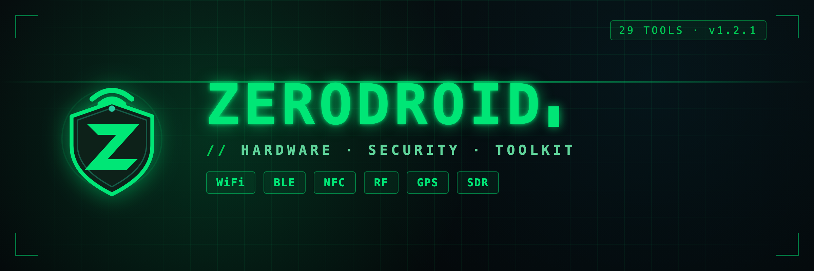
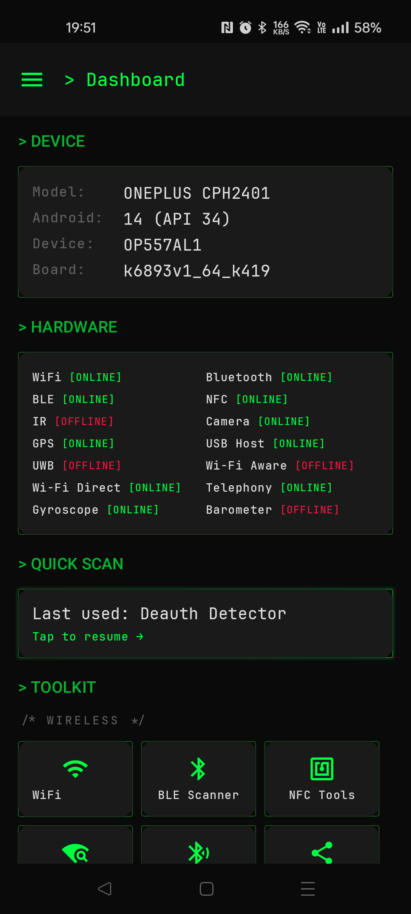
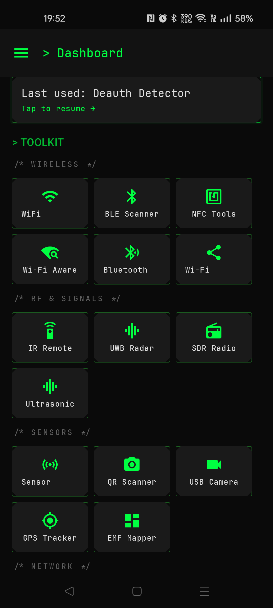
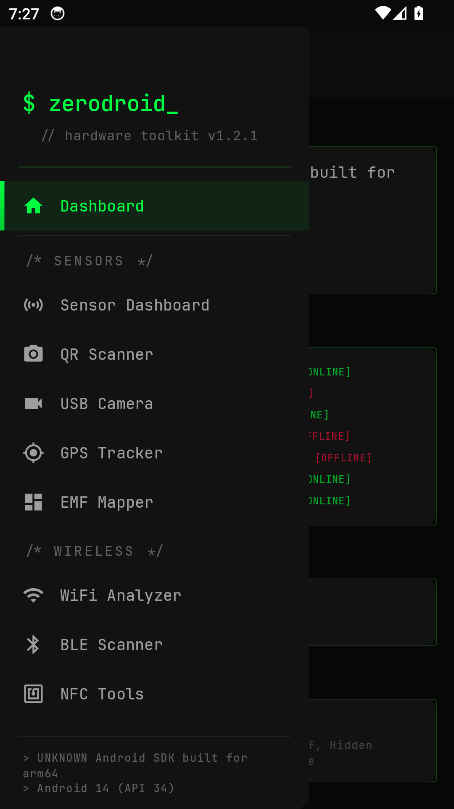

<p align="center">
  
</p>

<h1 align="center">ZeroDroid</h1>

<p align="center">
  <strong>The all-in-one Android hardware toolkit.</strong><br/>
  Turn your phone into a portable RF lab, network analyzer, and security auditor — <b>29 tools in one app</b>.
</p>

<p align="center">
  
  
  
  
  <a href="LICENSE"></a>
</p>

<p align="center">
  <a href="https://github.com/theabhishekchandra/ZeroDroid/releases/latest"></a>
  <a href="https://github.com/theabhishekchandra/ZeroDroid/actions/workflows/ci.yml"></a>
  <a href="https://github.com/theabhishekchandra/ZeroDroid/stargazers"></a>
  <a href="https://github.com/theabhishekchandra/ZeroDroid/network/members"></a>
  <a href="https://github.com/theabhishekchandra/ZeroDroid/issues"></a>
  
  
  
</p>

<p align="center">
  <a href="#-download--build">⬇️ Download</a> &nbsp;·&nbsp;
  <a href="#-features">🧰 Features</a> &nbsp;·&nbsp;
  <a href="docs/TOOLS.md">📖 Full Tool Guide</a> &nbsp;·&nbsp;
  <a href="#-screenshots">📸 Screenshots</a> &nbsp;·&nbsp;
  <a href="#-faq">❓ FAQ</a> &nbsp;·&nbsp;
  <a href="#-contributing">🤝 Contributing</a>
</p>

---

## ⚡ At a Glance

ZeroDroid exposes every radio, sensor, and port your phone has — WiFi, Bluetooth, BLE, NFC, IR, UWB, USB, GPS, cellular, magnetometer, barometer, microphone — through **29 specialized tools** wrapped in a terminal-hacker UI.

|  |  |
|---|---|
| 🧰 **29 tools** | Across 5 categories: Wireless · RF & Signals · Sensors · Network · Security |
| 📡 **Every radio** | WiFi, BLE, Classic BT, NFC, IR, UWB, SDR, cellular, GPS |
| 🔋 **Zero idle battery** | No auto-start scanning, everything auto-stops, all services lazy-loaded |
| 🔒 **Privacy-first** | Runs 100% on-device · no account · permissions requested only when needed |
| 📱 **Android 8.0+** | Min SDK 26, target SDK 36 · works best on Android 12+ |
| 🆓 **Open source** | MIT licensed · Kotlin · Jetpack Compose · Material 3 |

> Built for penetration testers, security researchers, RF engineers — and anyone curious about the invisible wireless world around them.

---

## 📸 Screenshots

<table align="center">
  <tr>
    <td align="center" width="33%"></td>
    <td align="center" width="33%"></td>
    <td align="center" width="33%"></td>
  </tr>
  <tr>
    <td align="center"><sub><b>📊 Dashboard</b><br/>Device &amp; hardware grid</sub></td>
    <td align="center"><sub><b>🧰 Toolkit</b><br/>29 tools by category</sub></td>
    <td align="center"><sub><b>🧭 Navigation</b><br/>Terminal-styled drawer</sub></td>
  </tr>
</table>

---

## 🎯 The Problem

Your phone sits in a sea of invisible signals. Right now, within ~30 meters of you:

- 📷 **Hidden cameras** may be streaming over WiFi or BLE — invisible to you.
- 🏷️ **AirTags / SmartTags** could be tracking your location without your knowledge.
- 🎭 **Rogue WiFi hotspots** (evil twins) mimic real networks to steal credentials.
- 📶 **IMSI catchers** (Stingrays) force your phone to 2G to intercept calls & texts.
- 🔊 **Ultrasonic beacons** (18–24 kHz) track you across devices through your mic.
- 🚫 **Deauth attacks** kick you off WiFi — disguised as "bad signal".
- 🔌 **BadUSB devices** pretend to be keyboards to type malicious commands.

No single app detects all of these. Security pros carry a bag of separate gadgets; regular users have nothing. **ZeroDroid puts them all in one place.**

---

## 🧰 Features

Every tool solves a specific, real problem. Full step-by-step docs live in the **[📖 Complete Tool Guide →](docs/TOOLS.md)**.

<details open>
<summary><b>📡 Wireless</b></summary>

| Tool | What it does |
|------|--------------|
| **WiFi Analyzer** | Scans networks, finds channel congestion, flags weak security (OPEN/WEP/WPA) |
| **BLE Scanner** | Discovers BLE devices with full GATT explorer, distance estimates, JSON dumps |
| **NFC Tools** | Reads NDEF, dumps MIFARE Classic sectors, emulates tags via HCE |
| **Bluetooth Classic** | Discovery, SDP service listing, SPP serial connections |
| **Wi-Fi Aware** | NAN device-to-device discovery without a router |
| **Wi-Fi Direct** | Peer discovery, group formation, direct P2P file transfer |
</details>

<details>
<summary><b>📻 RF & Signals</b></summary>

| Tool | What it does |
|------|--------------|
| **IR Remote** | Pre-built Samsung/LG/Sony remotes, custom protocols, Flipper Zero `.ir` import |
| **UWB Radar** | FiRa compliance & capability check (ranging, AoA, ToF) |
| **SDR Radio** | Detects RTL-SDR, HackRF, AirSpy dongles via USB OTG |
| **Ultrasonic Analyzer** | FFT spectrum of 18–24 kHz to detect tracking beacons |
</details>

<details>
<summary><b>🎚️ Sensors</b></summary>

| Tool | What it does |
|------|--------------|
| **Sensor Dashboard** | Accelerometer, gyroscope, magnetometer, barometer, compass, level, metal detector |
| **QR Scanner** | Scans + analyzes codes for phishing URLs & suspicious TLDs before opening |
| **USB Camera** | UVC camera detection with resolution & capability listing |
| **GPS Tracker** | Live position, GNSS satellite list, raw NMEA log |
| **EMF Mapper** | Magnetometer field mapping with baseline deviation & hotspots |
</details>

<details>
<summary><b>🌐 Network</b></summary>

| Tool | What it does |
|------|--------------|
| **USB Devices** | Full USB inspection + BadUSB (HID + Mass Storage) detection |
| **Cell Tower Analyzer** | Monitors towers; detects IMSI catchers (LAC change, signal spike, 2G downgrade) |
| **Wardriving** | Background GPS+WiFi logging with WiGLE CSV export |
</details>

<details>
<summary><b>🛡️ Security</b></summary>

| Tool | What it does |
|------|--------------|
| **Hidden Camera Detector** | 5 methods: WiFi OUI, SSID, BLE, magnetometer, port scan |
| **GPS Spoof Detector** | 7 cross-validation checks (GPS vs cell/WiFi/barometer/accelerometer) |
| **Tracker Scanner** | Identifies AirTag, SmartTag, Tile, Chipolo, Pebblebee by signature |
| **Rogue AP Detector** | 6 algorithms: evil twin, SSID spoofing, karma, open impersonator |
| **Network Scanner** | Subnet-wide port scan, banner grabbing, vulnerability assessment |
| **RF Bug Sweeper** | BLE module + ultrasonic + magnetic anomaly sweep |
| **Proximity Radar** | Visual radar plotting devices by estimated distance & signal |
| **Privacy Score** | 16+ checks across WiFi, Bluetooth, device, network & physical security |
| **Deauth Detector** | Detects deauth floods, jamming, AP disappearance, channel hopping |
| **Signal Logger** | Continuous WiFi+BLE timeline with arrival/departure tracking |
| **Alert Center** | Unified, persisted feed of every threat raised by the other Security tools |
</details>

---

## ⬇️ Download & Build

> 📦 Prebuilt APK releases are on the [Releases](https://github.com/theabhishekchandra/ZeroDroid/releases) page. To build from source:

### Prerequisites
- Android Studio **Ladybug (2025.1+)** or newer
- **JDK 17+**, Android **SDK 36**
- A **physical Android device** (many features need real hardware)

### Build & install

```bash
git clone https://github.com/theabhishekchandra/ZeroDroid.git
cd ZeroDroid
./gradlew assembleDebug
adb install -r app/build/outputs/apk/debug/app-debug.apk
```

| Requirement | Minimum |
|-------------|---------|
| Android version | 8.0 (API 26) |
| Target SDK | 36 |
| Recommended | Android 12+ for full BLE/WiFi features |

---

## 🗺️ Roadmap

Planned improvements — ideas and PRs welcome!

- [ ] Signed APK releases + F-Droid distribution
- [x] GitHub Actions CI (build + lint on every PR)
- [x] Unified Alert Center — persisted, cross-tool threat feed (shipped instead of the
      originally-planned per-scan JSON/PDF export; export may still come later)
- [ ] Optional light theme
- [ ] Expanded SDR & tracker signature databases
- [ ] Localization / translations
- [x] Unit test coverage for domain/util logic (109 tests) — instrumentation tests still open

---

## ❓ FAQ

<details>
<summary><b>Is ZeroDroid legal to use?</b></summary>

The app is legal. How you use it is your responsibility. Only scan, probe, or test networks and devices you **own or have written permission** to assess. See the [Disclaimer](#-disclaimer) and the in-app Ethical Use Agreement.
</details>

<details>
<summary><b>Does it require root?</b></summary>

No. ZeroDroid uses only standard Android APIs and runtime permissions — no root, no custom ROM.
</details>

<details>
<summary><b>Why does it ask for location permission?</b></summary>

Android **requires** location permission to return WiFi and Bluetooth scan results — it's a platform rule, not a data grab. Permissions are requested only when you open a feature that needs them.
</details>

<details>
<summary><b>Will every tool work on my phone?</b></summary>

No — tools depend on your hardware (IR blaster, UWB, barometer, etc. aren't on every device). The **Dashboard shows exactly which capabilities your device has** so you know what will work. See [Hardware Compatibility](#-hardware-compatibility).
</details>

<details>
<summary><b>Does it drain my battery?</b></summary>

No. Nothing scans until you tap start, every scanner auto-stops after a timeout, and all services are lazy-loaded. The home screen costs effectively zero battery. See [Battery Optimization](#-battery-optimization).
</details>

<details>
<summary><b>Is my data collected?</b></summary>

Everything runs on-device. There's no login and no account. Permissions are requested only when a specific feature needs them.
</details>

---

## 🏗️ Architecture

<details>
<summary><b>App structure & key design decisions</b></summary>

```
ZeroDroidApp (@HiltAndroidApp Application)
 └── Hilt DI (core/di/*Module.kt — services scoped per module, most unscoped/fresh-per-use)
      ├── SystemServiceModule (SensorManager, WifiManager, BluetoothManager, ...)
      ├── HardwareModule (HardwareChecker — 16 capability queries)
      ├── DatabaseModule (Room, 5 entities: BLE, NFC, Wardriving, QR, Alert)
      ├── FeatureModule (~25 domain/repository classes across every tool)
      └── PreferencesModule, NfcTagBus

Navigation: Jetpack Navigation Compose + ModalNavigationDrawer
Pattern: MVVM (Screen → @HiltViewModel → Domain → Hardware)
UI: Jetpack Compose + Material 3 (dark terminal theme)
Font: JetBrains Mono throughout
```

**Key design decisions:**

- **All services are lazy-initialized.** Nothing starts until you navigate to that feature. The app launches to a zero-cost Dashboard.
- **No auto-start scanning.** Every scanner requires a manual tap to start, and auto-stops after a timeout (sensors: 60s, WiFi/BLE: 30s).
- **No `saveState` in navigation.** When you leave a screen, its `DisposableEffect.onDispose` fires and scanning stops immediately.
- **Sensor polling at 5Hz, not 60Hz.** `SENSOR_DELAY_NORMAL` instead of `SENSOR_DELAY_UI` — 12x fewer events with no visible difference.
- **BLE uses `SCAN_MODE_LOW_POWER`** instead of `LOW_LATENCY` — 10x less battery drain.

Each feature follows the same structure:
```
feature/
├── domain/      # Business logic, scanners, analyzers (no Android UI imports)
├── data/        # Repositories (if Room persistence needed)
├── ui/          # Composable screens and components
└── viewmodel/   # @HiltViewModel with @Inject constructor
```
</details>

---

## 🔋 Battery Optimization

<details>
<summary><b>How ZeroDroid stays at zero idle battery</b></summary>

| Optimization | Before | After | Impact |
|-------------|--------|-------|--------|
| Home screen | SensorScreen (6 sensors at 60Hz) | Dashboard (static Build info) | ~360 events/sec → 0 |
| Sensor polling | `SENSOR_DELAY_UI` (60Hz) | `SENSOR_DELAY_NORMAL` (5Hz) | 12x fewer events |
| BLE scan mode | `SCAN_MODE_LOW_LATENCY` | `SCAN_MODE_LOW_POWER` | ~10x less battery |
| Auto-start | Sensors + WiFi start on screen load | Manual start button required | No scanning unless you ask |
| Auto-stop | Never (runs forever) | Sensors: 60s, WiFi: 30s, BLE: 30s | Forgotten scans can't drain battery |
| Service init | 25+ services created at app launch | All `by lazy` (created on first use) | Startup cost → near zero |
| Navigation | `saveState=true` (keeps disposed screens alive) | No saveState (dispose fires on navigate away) | Scanners stop when you leave |
</details>

---

## 🔐 Permissions

ZeroDroid requests permissions **only when you open a feature that needs them** — nothing at startup.

<details>
<summary><b>Full permission list</b></summary>

| Permission | Required By | Why |
|-----------|-------------|-----|
| `BLUETOOTH_SCAN` | BLE Scanner, Tracker Scanner, RF Bug Sweeper, Proximity Radar, Hidden Camera, Privacy Score | Discover Bluetooth devices |
| `BLUETOOTH_CONNECT` | BLE Scanner (GATT), Bluetooth Classic, NFC (HCE), RF Bug Sweeper | Connect to devices |
| `ACCESS_FINE_LOCATION` | WiFi Analyzer, GPS Tracker, Wardriving, Cell Tower, Rogue AP, Proximity Radar, GPS Spoof, Hidden Camera | Android requires location for WiFi/BLE scanning |
| `ACCESS_COARSE_LOCATION` | Fallback for location-based features | Approximate location |
| `ACCESS_WIFI_STATE` | WiFi Analyzer, Network Scanner, Deauth Detector | Read WiFi scan results |
| `CHANGE_WIFI_STATE` | WiFi Analyzer | Trigger WiFi scans |
| `NEARBY_WIFI_DEVICES` | Wi-Fi Direct (API 33+) | Discover WiFi Direct peers |
| `CAMERA` | QR Scanner, Hidden Camera (port scan uses camera preview) | Camera access for scanning |
| `NFC` | NFC Tools | Read/write NFC tags |
| `TRANSMIT_IR` | IR Remote | Send infrared commands |
| `READ_PHONE_STATE` | Cell Tower, GPS Spoof Detector | Access cell tower data |
| `RECORD_AUDIO` | Ultrasonic Analyzer, RF Bug Sweeper, Privacy Score | Microphone for ultrasonic detection |
| `FOREGROUND_SERVICE` | Wardriving | Background scanning service |
| `POST_NOTIFICATIONS` | Wardriving (API 33+) | Foreground service notification |
| `UWB_RANGING` | UWB Radar | Ultra-wideband distance ranging (API 31+) |
</details>

---

## 📱 Hardware Compatibility

Not all phones have all hardware. The Dashboard shows which capabilities your device has.

<details>
<summary><b>Hardware → feature matrix</b></summary>

| Hardware | Common Availability | Features That Need It |
|----------|-------------------|----------------------|
| WiFi | All phones | WiFi Analyzer, Wardriving, Rogue AP, Network Scanner, Deauth Detector |
| Bluetooth/BLE | All modern phones | BLE Scanner, Bluetooth Classic, Tracker Scanner, RF Bug Sweeper |
| NFC | Most flagship phones | NFC Tools |
| GPS | All phones | GPS Tracker, Wardriving, GPS Spoof Detector |
| Camera | All phones | QR Scanner, Hidden Camera |
| Accelerometer | All phones | Sensor Dashboard, GPS Spoof Detector |
| Magnetometer | Most phones | Compass, Metal Detector, EMF Mapper, RF Bug Sweeper |
| Gyroscope | Most phones | Sensor Dashboard |
| Barometer | Some phones | Floor estimation, GPS Spoof Detector |
| Consumer IR | Some Samsung, Xiaomi, Huawei | IR Remote |
| UWB | Pixel 6 Pro+, Samsung S21+ | UWB Radar |
| Wi-Fi Aware | Limited devices | Wi-Fi Aware |
| USB Host | Most phones with OTG | USB Devices, SDR Radio, USB Camera |
</details>

---

## 🛠️ Tech Stack

<p align="center">
  
  
  
  
  
  
  
  
</p>

<p align="center"><sub><b>Architecture:</b> MVVM (ViewModel + StateFlow + Compose) · Hilt DI · Room (auto-migration) · Dark Material 3 theme with JetBrains Mono</sub></p>

<details>
<summary><b>Full dependency versions</b></summary>

| Layer | Technology |
|-------|-----------|
| Language | Kotlin 2.2.0 |
| UI Framework | Jetpack Compose (BOM 2026.06.01) |
| Design System | Material 3 (dark theme, JetBrains Mono, CutCornerShape) |
| Architecture | MVVM (ViewModel + StateFlow + Compose) |
| Navigation | Jetpack Navigation Compose 2.9.8 |
| DI | Hilt 2.60.1 |
| Database | Room 2.8.4 (5 entities, auto-migration) |
| Camera | CameraX 1.6.1 |
| Barcode | ML Kit Barcode 17.3.0 + ZXing 3.5.3 |
| Location | Play Services Location 21.4.0 |
| Ranging | Jetpack Core UWB 1.0.0 |
| Permissions | Accompanist Permissions |
| Build | Gradle 9.7.0, AGP 9.3.1 |
| Min / Target SDK | 26 (Android 8.0) / 37 |
</details>

---

## 📂 Project Structure

<details>
<summary><b>Directory layout</b></summary>

```
app/src/main/java/com/abhishek/zerodroid/
├── MainActivity.kt                  # Entry point (@AndroidEntryPoint), NFC intent handling
├── ZeroDroidApp.kt                  # Application class (@HiltAndroidApp)
├── core/
│   ├── alerts/                      # Alert Center: AlertModels, AlertCenterRepository
│   ├── database/                    # Room DB, DAOs, entities, converters
│   ├── di/                          # Hilt modules — SystemServiceModule, FeatureModule,
│   │                                  DatabaseModule, HardwareModule, PreferencesModule, NfcTagBus
│   ├── hardware/HardwareChecker.kt  # 16 hardware capability queries
│   ├── permission/                  # PermissionGate composable, PermissionUtils
│   ├── ui/                          # TerminalCard, EmptyState, ScanningIndicator,
│   │                                  StatusIndicator, EthicalUseDialog, HelpContent
│   └── util/                        # FrequencyUtils, ByteArrayExt
├── features/                        # 29 tools — one package each (see below)
│   ├── dashboard/  alert_center/  sensors/  wifi/  ble/  nfc/  bluetooth_classic/  ir/  uwb/
│   ├── sdr/  ultrasonic/  usb/  usbcamera/  gps/  celltower/  wardriving/
│   ├── wifi_direct/  wifiaware/  emf_mapper/  camera/  hidden_camera/
│   ├── gps_spoof_detector/  bluetooth_tracker/  rogue_ap_detector/
│   └── network_scanner/  rf_bug_sweeper/  proximity_radar/  privacy_score/
│       deauth_detector/  signal_logger/
├── navigation/
│   ├── ZeroDroidScreen.kt          # 29 screen definitions, 5 categories
│   ├── AppNavigation.kt            # NavHost + drawer + help system
│   └── DrawerContent.kt            # Terminal-styled navigation drawer
└── ui/theme/
    ├── Color.kt                     # Terminal green, amber, red, cyan palette
    ├── Theme.kt                     # Dark-only Material 3 theme
    └── Type.kt                      # JetBrains Mono typography
```
</details>

---

## ⚖️ Ethical Use

ZeroDroid shows an **Ethical Use Agreement** on first launch that cannot be dismissed. Users must accept:

- ✅ Use only on networks and devices you own or are authorized to test
- ✅ Comply with all local laws on wireless scanning and network analysis
- 🚫 No unauthorized surveillance, tracking, or network attacks
- 🛡️ Report vulnerabilities responsibly through proper channels

Declining the agreement exits the app.

---

## 🌳 Branching & Workflow

ZeroDroid uses a two-branch model — no one pushes directly to a protected branch, everything goes through a PR with CI passing.

| Branch | Purpose | Protection |
|--------|---------|------------|
| **`develop`** | Default branch — all active work happens here | PR + passing `build` CI required · no force-push/delete |
| **`main`** | Stable/release branch — only updated from `develop` | PR + passing `build` CI required, **enforced for everyone including admins** · linear history only (squash/rebase) · no force-push/delete |

**Contributor flow:**

```bash
git checkout develop
git pull
git checkout -b feature/my-tool develop
# ...make changes...
git push -u origin feature/my-tool
# open a PR into develop
```

- New work branches off **`develop`** and PRs target **`develop`**, not `main`.
- `main` only moves forward via a PR from `develop` (release cuts), never a direct push or a PR from a feature branch.
- Every PR must pass the `build` CI check (lint, unit tests, debug assemble) before it can merge.

---

## 🤝 Contributing

Contributions are welcome — bug reports, new tool ideas, hardware compatibility notes, and pull requests.
See [CONTRIBUTING.md](CONTRIBUTING.md) for the full guide (dev setup, project conventions, adding a
new tool, testing expectations). Short version:

1. **Fork** the repo and create a feature branch off `develop`: `git checkout -b feature/my-tool develop`
2. Follow the existing feature structure (`domain/` → `data/` → `ui/` → `viewmodel/`) — keep Android UI imports out of `domain/`.
3. Match the code style: Kotlin, MVVM, StateFlow, Jetpack Compose, JetBrains Mono terminal aesthetic, Hilt for DI.
4. Test on a **physical device** — most features depend on real hardware.
5. Commit with a clear message and open a **pull request into `develop`** describing what changed and how you verified it.

When adding a new tool: register its screen in `navigation/ZeroDroidScreen.kt`, wire any new
service into the relevant `core/di/*Module.kt`, and document it in [`docs/TOOLS.md`](docs/TOOLS.md).

This project follows the [Contributor Covenant](CODE_OF_CONDUCT.md).

---

## 💬 Support

- 🐛 **Bugs & feature requests:** [open an issue](https://github.com/theabhishekchandra/ZeroDroid/issues)
- 💡 **Questions & ideas:** start a [discussion](https://github.com/theabhishekchandra/ZeroDroid/discussions)
- 🔒 **Security disclosures:** please report privately via [SECURITY.md](SECURITY.md) rather than in a public issue

If ZeroDroid is useful to you, consider **starring the repo** ⭐ — it helps others discover the project.

---

## ⚠️ Disclaimer

ZeroDroid is provided **for educational purposes, authorized security research, and defensive use only**.

The tools in this app inspect radios, sensors, and networks around you. Using them to access, monitor, disrupt, or attack networks, devices, or people **without explicit authorization is illegal** in most jurisdictions and is **not** the intended use of this software.

- You are solely responsible for how you use ZeroDroid and for complying with all applicable laws.
- Only scan, probe, or test networks and devices you **own** or have **written permission** to assess.
- Detection features (IMSI catchers, hidden cameras, trackers, rogue APs, etc.) are heuristics and **may produce false positives or miss real threats** — don't rely on them as your sole security measure.
- The author(s) and contributors accept **no liability** for misuse or for any damages arising from use of this software. It is provided "as is", without warranty of any kind.

By building, installing, or using ZeroDroid, you agree to these terms and to the in-app Ethical Use Agreement.

---

## 📄 License

Licensed under the [MIT License](LICENSE).

<p align="center">
  <sub>Built with ☕ and Kotlin · If you find ZeroDroid useful, drop a ⭐</sub>
</p>
 
